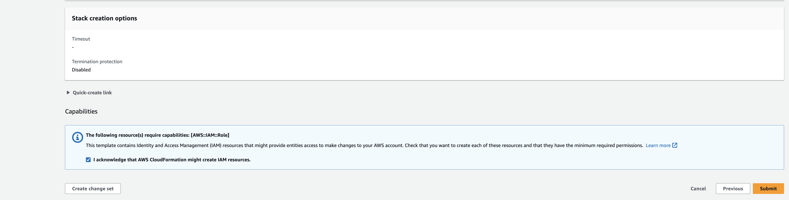

# Github OIDC AWS Cloudformation.

Cloudformation template for configuring OIDC connection from github actions to your AWS account.

## Step 1: Click the button to launch the cloudformation stack.

[](https://console.aws.amazon.com/cloudformation/home#/stacks/new?stackName=github-oidc-connection&templateURL=https://public-assets-vincent-claes.s3.eu-west-1.amazonaws.com/github-oidc-aws-cloudformation/github-oidc-aws-cloudformation.yml)

- Click Next


- Specify stack details
  - Add github organization and repo name.
  - I added Admin policies, but probably better to refine this policy.
  - Click Next
  


- Click Next


- Click Acknowledgement and Click Submit




## Step 2: Take the role arn from the outputs.

- When the stack is deployed go to "Outputs" tab
- Copy the role ARN


## Step 3: Configure in Github.

- Go to your github repo > Settings > Secrets and variables > Actions > New Repository Secret.
- Add as name "DEPLOY_ROLE" and add the arn of the role you got in the previous step.


## Step 4: Update github actions workflow

- In your Github Actions workflow update your credentials with the `DEPLOY_ROLE` you created and add permissions to request a session token.

``` yaml
jobs:
  build:
    runs-on: ubuntu-latest
    permissions:
      id-token: write # <-- we need this to get a session token
      contents: write # <-- not 100% what this is about, but it made me deploy to AWS
    steps:
      - name: Configure AWS credentials
        uses: aws-actions/configure-aws-credentials@v1
        with:
          aws-region: eu-west-1
          role-to-assume: ${{ secrets.DEPLOY_ROLE }}
          role-session-name: OIDCSession

      - name: Checkout repo
        uses: actions/checkout@v3
```

## 5. Now you are all set!